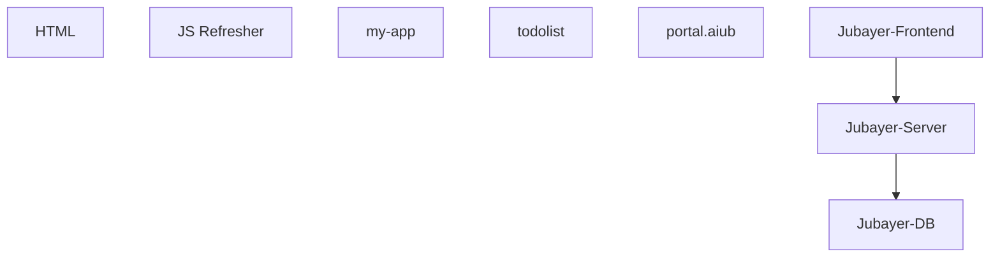

## 1. Stack
- No root manifest — this repo is a collection of independent learning projects, each with its own `package.json`.
- Plain HTML/JS demos (`HTML/`, `JS Refresher/`) — no build step.
- React 19 via Create React App / `react-scripts 5.0.1` (`my-app/`, `todolist/`, `portal.aiub/`); `my-app` adds `react-router-dom`, `qrcode`.
- `Jubayer task/src`: Vite + React 19 + TypeScript (`test-for-venturas`), `axios`, `react-router-dom`.
- `Jubayer task/server`: NestJS 10 + TypeORM + `mysql2`; `Jubayer task/db`: MySQL via `docker-compose`.

## 2. Directory map
| path | what lives there |
|---|---|
| `HTML/index.html` | static HTML/JS demo (rate-limiter/queue visualization) |
| `JS Refresher/index.html` | static JS refresher exercise page |
| `my-app/` | CRA React app — routing, QR generator, chat box |
| `my-app/src/components/` | Navbar, Text, QrGenerator, ChatBox |
| `todolist/` | CRA React todo-list app |
| `portal.aiub/` | CRA React clone of the AIUB portal |
| `Jubayer task/db/` | docker-compose + MySQL init scripts |
| `Jubayer task/server/` | NestJS + TypeORM backend (`src/main.ts`) |
| `Jubayer task/src/` | Vite + React + TS frontend (`main.tsx`/`App.tsx`) |

## 3. Diagram

## 4. Component index
- [[HTML]]
- [[JS Refresher]]
- [[my-app]]
- [[todolist]]
- [[portal.aiub]]
- [[Jubayer-Frontend]]
- [[Jubayer-Server]]
- [[Jubayer-DB]]

## 5. Entry points
- `HTML/index.html` — open directly, no dev server.
- `JS Refresher/index.html` — open directly, no dev server.
- `my-app`: dev `npm start` → `my-app/src/index.js`; prod `npm run build`.
- `todolist`: dev `npm start` → `todolist/src/index.js`; prod `npm run build`.
- `portal.aiub`: dev `npm start` → `portal.aiub/src/index.js`; prod `npm run build`.
- `Jubayer task/src`: dev `npm run dev` → `Jubayer task/src/main.tsx`; prod `npm run build`.
- `Jubayer task/server`: dev `npm run start:dev` → `Jubayer task/server/src/main.ts`; prod `npm run start:prod`.
- `Jubayer task/db`: `docker-compose up -d` (`Jubayer task/db/docker-compose.yml`).

## 6. Conventions
- CRA apps (`my-app`, `todolist`, `portal.aiub`) share identical scaffold: `App.js` + `index.js` + `App.css`/`index.css`, `App.test.js`, `reportWebVitals.js`, `setupTests.js`.
- Only `my-app` splits UI into `src/components/` (Navbar, Text, QrGenerator, ChatBox); `todolist` and `portal.aiub` keep everything in `App.js`.
- `Jubayer task/src` uses TypeScript + Vite tooling: `.eslintrc.js`, `.prettierrc`, `.editorconfig`, `.babelrc`, `App.tsx`/`main.tsx`.
- `Jubayer task/server` follows NestJS CLI scaffold (`nest-cli.json`, `src/main.ts`).
- Each subproject carries its own lockfile and is installed/run independently — no shared/root dependencies.

## 7. Where things go
- New route/page in `my-app` → `my-app/src/App.js` (add `<Route>`) + new file in `my-app/src/components/`.
- New standalone CRA practice project → new top-level folder with its own `package.json` (mirror `todolist/` or `portal.aiub/` scaffold).
- New backend endpoint → `Jubayer task/server/src` (NestJS module/controller/service).
- New frontend API call in the full-stack app → `Jubayer task/src/App.tsx` (or a new component) using `axios`.
- DB schema/seed change → `Jubayer task/db/init_db` + `Jubayer task/db/docker-compose.yml`.
